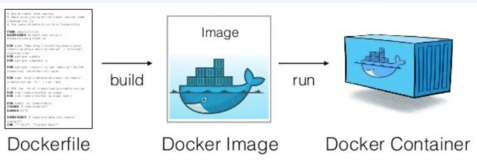
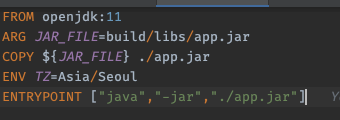
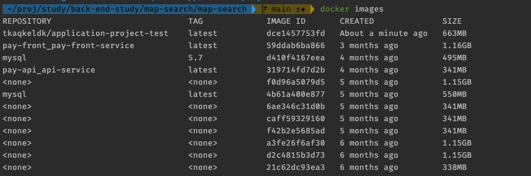
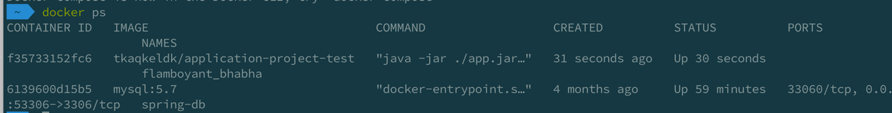
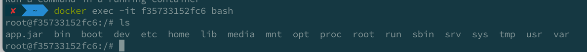

# Dockerfile 이란 
- 도커 이미지를 구성하기 위해 있어야 할 패키지, 의존성, 소스코드 등을 하나의 file 로 기록하여 이미지화 시킬 명령 파일
- 즉, 이미지는 컨테이너를 실행하기 위한 모든 정보를 가지고 있기 때문에 더 이상 새로운 서버가 추가되면 의존성 파일을 컴파일하고 이것 저것 설치할 필요하 없다!

# Dockerfile 작성하기

- FROM openjdk:11 <- 
- ARG JAR_FILE=build/libs/app.jar
  - 아규먼트를 지정할 수 있는데, 이경로에 jar 파일이 있어야 한다.
- COPY ${JAR_FILE} ./app.jar
    - COPY 명령어를 통해 jar 파일을 컨테이너에 복사한다.
- ENV TZ=Asia/Seoul
  - 타임존 설정 
- ENTRYPOINT ["java","-jar","./app.jar"]
  - 컨테이너가 실행될때 어떤 명령어가 실행 되어야 할지 지정한다. 

### Dockerfile 작성 후 빌드하기 명령어. 

- docker build -t tkaqkeldk/application-project-test .
  - -t 는 태그를 의미한다.
  - id 가 없으면 docker hub 에 push 할떄 어떤 repository 에 push 할지 몰라서 적어줘야 한다.
  - application-project-test 는 repository 이름이다.
  - . 은 현재 디렉토리를 의미한다.

### 아주 깔끔하게 들어갔다.

### 이제 띄워보자.
- **$ docker run tkaqkeldk/application-project-test -p 8080:8080**
  - -p 는 포트를 의미한다.
  - 8080:8080 은 외부 포트와 내부 포트를 의미한다.
  - 8080:8080 <- 앞이 host port, 뒤가 container port 이다.
  - tkaqkeldk/application-project-test 는 빌드한 이미지 이름이다.

### 잘 띄워졌다.

### bash 명령어로 터미널에 들어가 보자
