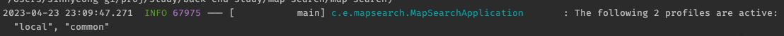

# profile

### 한파일에 작성
--- <- 구분자로 한파일에 작성할 수 있다.
- group 으로 active profile을 지정할 수 있다.
```yml
spring:
  profiles:
    active: local # default
    group:
      local:
        - common
      prod:
        - common

---
spring:
  config:
    activate:
      on-profile: common

---
spring:
  config:
    activate:
      on-profile: local
---
spring:
  config:
    activate:
      on-profile: prod

```

